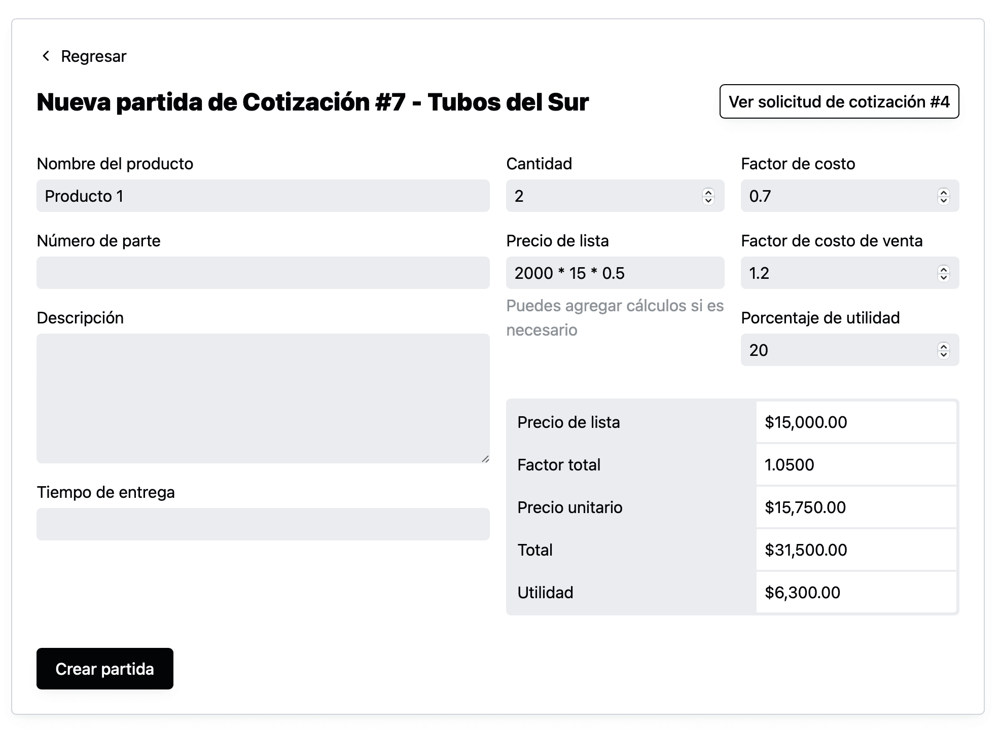

Anteriormente al agregar un partida manualmente en una cotización, para actualizar los cálculos del precio tenías que dar click en “Actualizar”, ahora ya todo pasa automáticamente.

Tú solo llenas los campos de relacionados al precio (cantidad, precio de lista, factores y porcentaje utilidad) el sistema actualizará los cálculos de precio de lista, factor total, precio unitario, total y utilidad.

Para conocer más sobre como funciona la actualización de cálculos automáticamente, puedes ver el post [Cómo agregar partida manualmente](/como-agregar-partida-manualmente).
