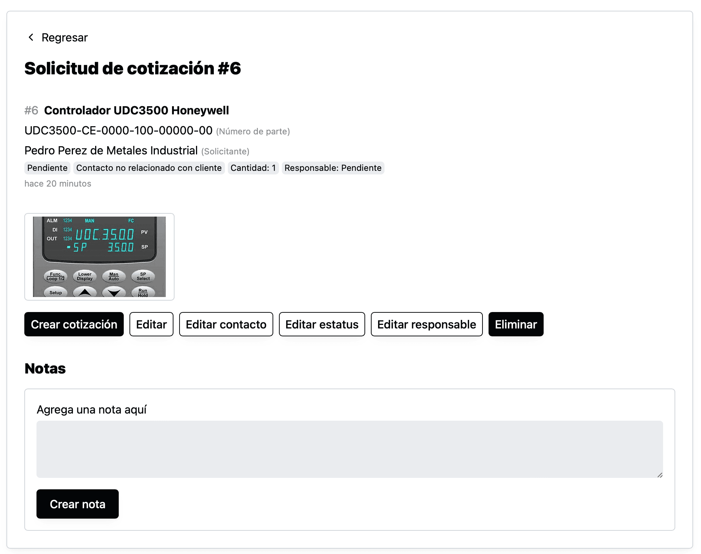

Ahora tanto tus clientes como los miembros de tu equipo pueden agregar imágenes y PDFs como archivos adjuntos a las solicitudes de cotización.

Cuando un cliente llega a la forma de solicitud de cotización, al final va a ver un campo para **Archivos adjuntos**, donde va a poder seleccionar imágenes y PDFs de su computadora o teléfono.

Y al dar click en “Crear solicitud de cotización”, el sistema va a guardar toda la información, incluyendo los archivos adjuntos y mostrará la solicitud creada a tu cliente.

Al dar click en la imagen podrá ver la imagen (o documento) completo en un nuevo tab.

De forma similar, los miembros de tu equipo podrán ver los documentos, con todos los controles que ven ellos en la solicitud.

Este cambio puede mejorar mucho la experiencia de tus clientes cuando [integras industrially con tu sitio web](/como-recibir-solicitudes-de-cotizacion-desde-tu-sitio-web.html).
