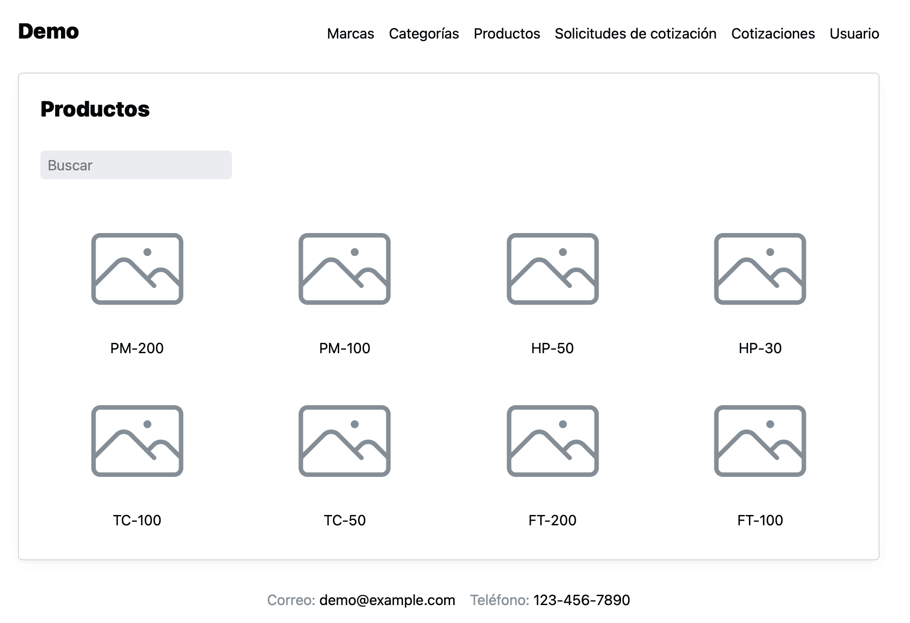
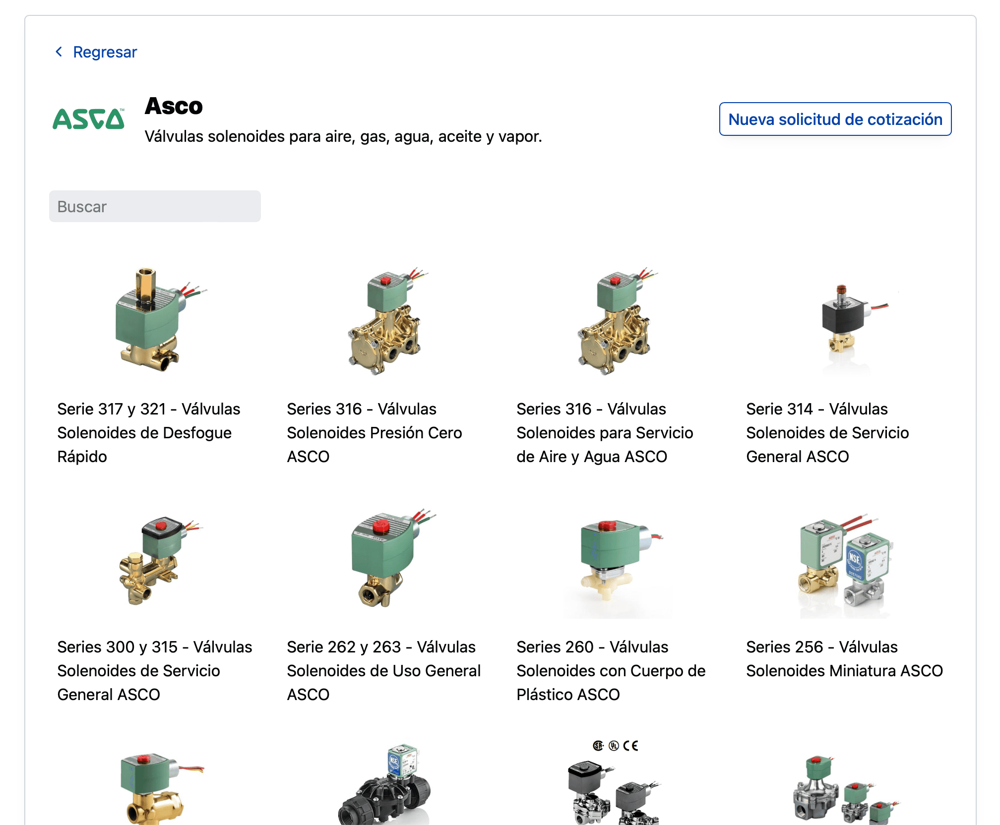
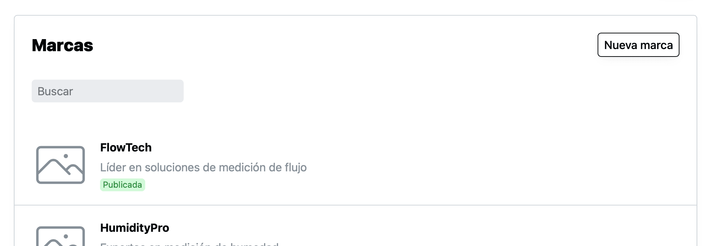
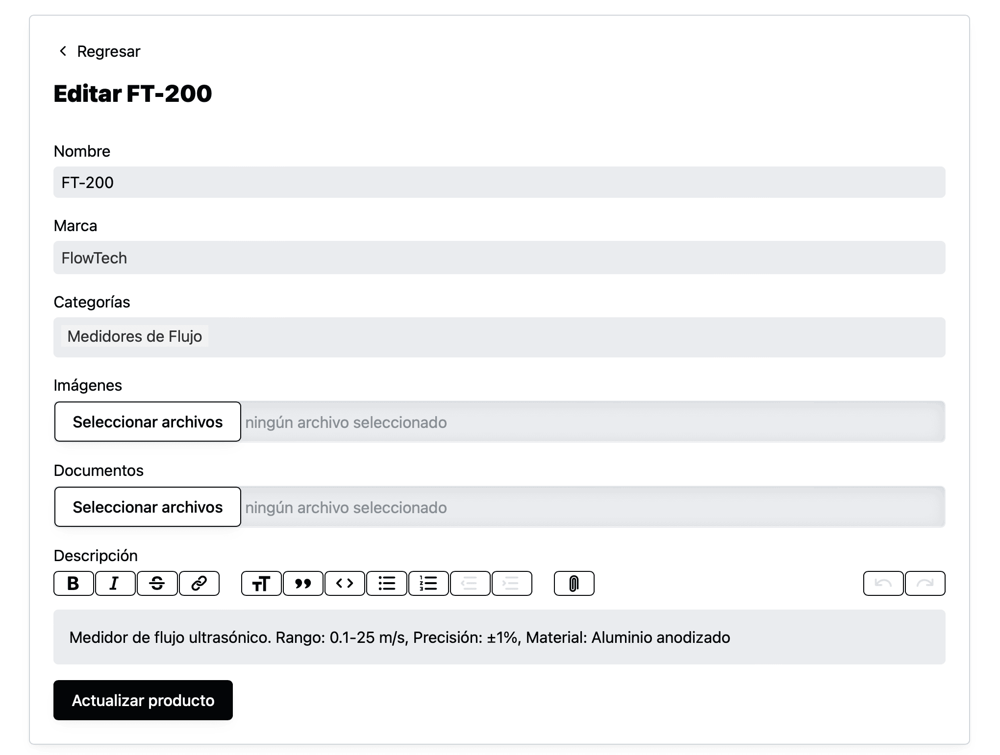

Ahora podrás crear tu catálogo de productos directamente en industrially.

Tendrás páginas para tus marcas y categorías con sus productos. Las páginas de productos con fotos descripción y documentos. Tus clientes podrás solicitar cotización directamente desde esas páginas.

También tendrás un nueva página de inicio que mostrará tus marcas, categorías y productos, para que tus clientes puedan ver fácilmente lo que puedes ofrecer.

## Cómo se vería el catálogo

Tus clientes tendrán una barra de navegación para acceder a tus marcaras, categorías y productos. En las tres páginas tendrán la posibilidad de “buscar”.

Por ejemplo aquí una muestra con imágenes de nuestro demo:

Aquí una muestra de una página de una marca real:

Internamente en cada página de productos podrás agregar varias imágenes, documentos y una descripción usando un editor de texto. Aquí un ejemplo también de un producto real.

## Cómo se vería la página de inicio

Dependiendo de la información que tengas en tu sitio la página de inicio irá mostrando las secciones relacionadas. Si no tuvieras publicada información para alguna sección el sistema no lo mostraría.

Podrá configurar tu logo, una imagen de fondo, el mensaje inicial y los colores de tu sitio para que comuniquen la marca de tu empresa.

## Cómo se crea el catálogo

Tu equipo tendrá formas y controles intuitivos para poder modificar la información fácilmente.

## Cómo puedes empezar a usarlo

Todos las cuentas de Industrially tienen acceso, solo crea una cuenta y podrás empezar a publicar el catalogo hoy mismo.