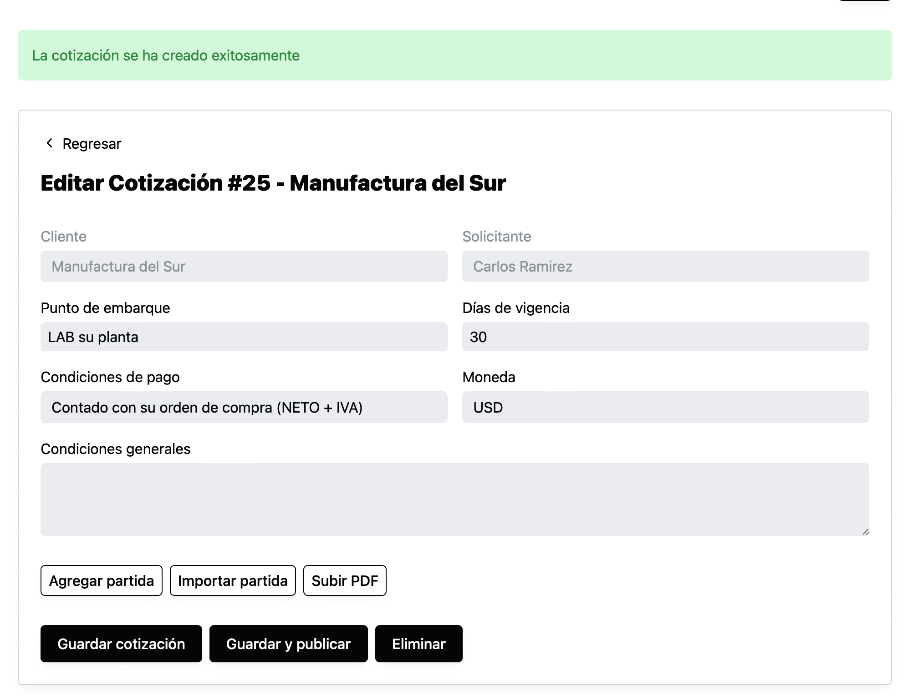

Anteriormente para crear una cotización era necesario primero tener una solicitud de cotización. Esto porque creíamos que servía para mantener el orden de la información y que todas las cotizaciones tuvieran una justificación de por qué se hicieron.

Hemos notado que en algunos casos puede ser trabajo innecesario para algunos equipos tener que crear la solicitud manualmente cuando el cliente no lo hizo directamente en el sistema.

Si este fuera el caso y creen que es mejor crear una cotización directamente sin una solicitud ahora pueden hacerlo.

En la página de cotización ahora hay un botón de “Nueva cotización”…

… que al darle click mostrará una forma para elegir el solicitante…

… y poder ahora sí crear la cotización.

Todo lo demás funciona de la misma forma.