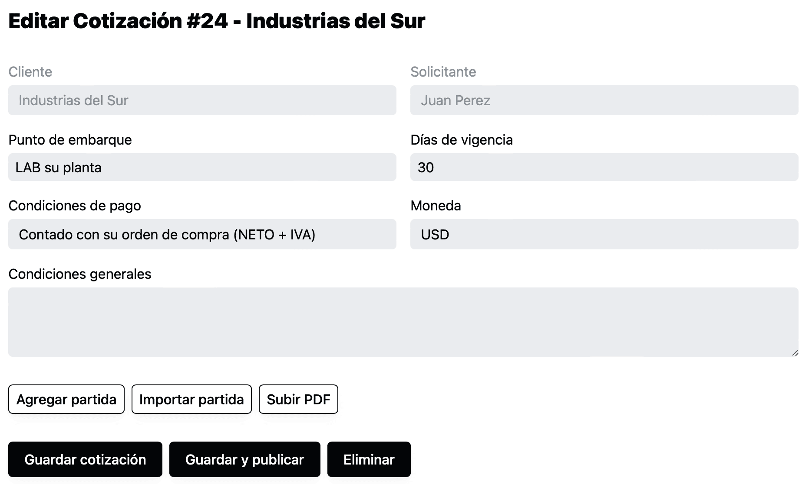

Anteriormente si modificabas algo en la sección superior de la forma de la cotización, y después intentabas agregar partida, importar partida o subir un pdf, sin dar previamente click en “Guardar cotización” el sistema no guardaba los cambios y las modificaciones previas se perdían.

Ahora el sistema automáticamente va a intentar guarda los datos de la forma cada tres segundos y también cuando sales de la página. No es necesario pensar en eso, pero así es como funciona.

Al guardar se va a mostrar un pequeño mensaje de “Guardando…” en la parte inferior derecha que tal vez sea difícil de alcanzar a ver, porque la intención es que no sea muy intrusivo pero puedas llegar a notarlo.

