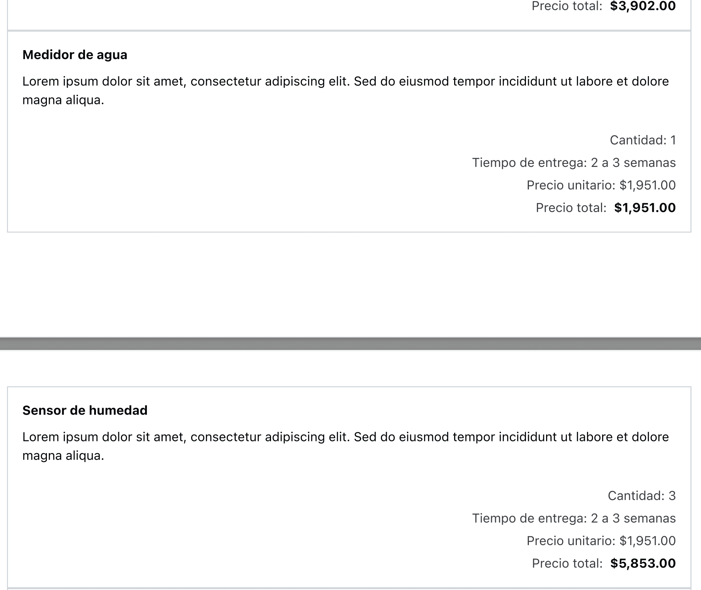

Anteriormente, cuando imprimías la cotización, la letra era muy pequeña y teníamos el problema que cuando la cotización tenía muchas partidas, el bloque de una partida se cortaba al pasar a la siguiente hoja.

Hicimos un cambio para aumentar un poco el tamaño de la letra y tratar de evitar que se rompa una partida al cambiar la hoja.

Aquí una muestra de como se ve ahora la letra:

Y una muestra de como se rompe la página:

Y aquí un [ejemplo de una cotización en pdf](mejoras-en-la-impresion-de-cotizacion/ejemplo-cotizacion.pdf).