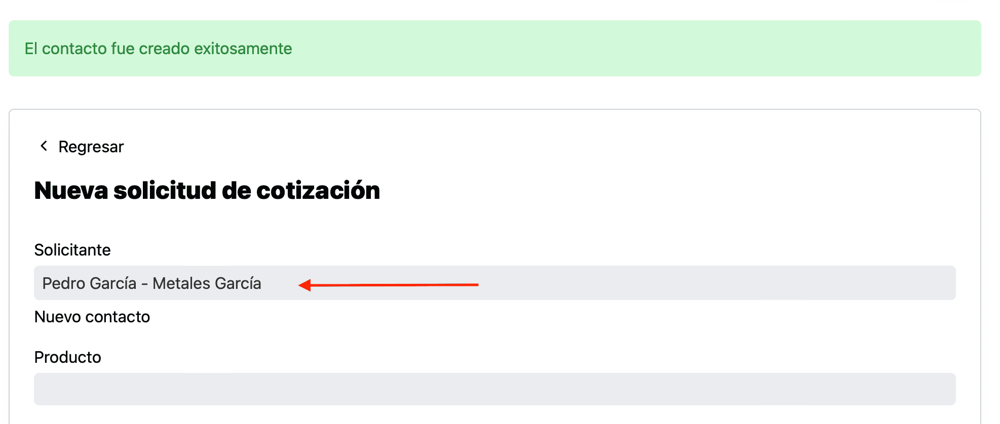

Queremos compartir una mejora sutil, pero que puede ayudar a registrar las solicitudes de cotización de nuevos clientes y contactos de forma mucho más ágil.

Al crear una solicitud de cotización en la que necesitaba crear un nuevo cliente o contacto, después de crear el cliente o contacto, el sistema te regresaa a la forma para que ahi buscaras el registro que habías creado.

Ahora después de crear ese nuevo cliente o contacto el sistema preselecciona el registro que acabas de crear, para que puedas continuar con llenando los datos de la solicitud de cotización.

