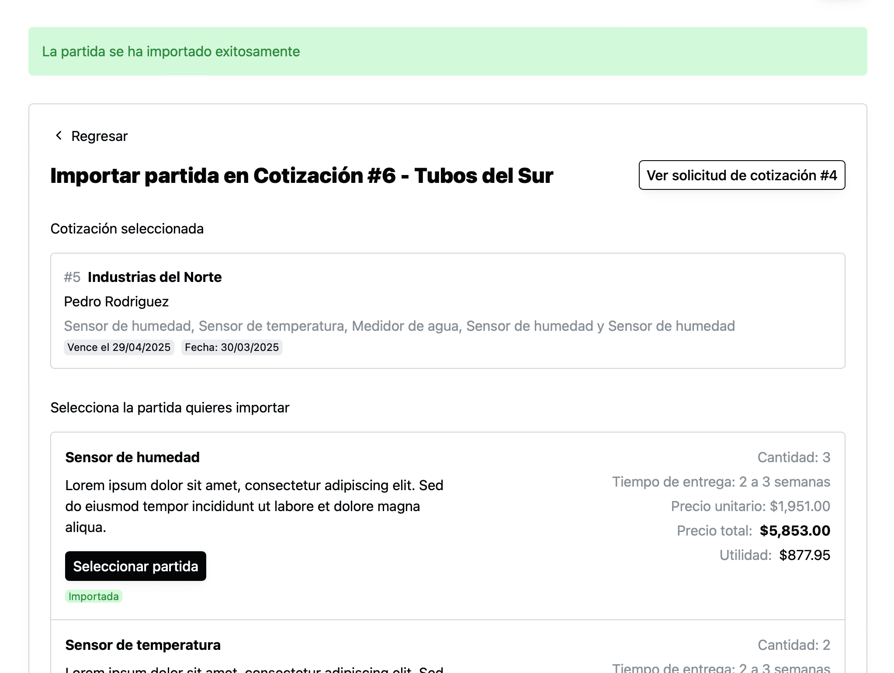

Antes al agregar un partida, el sistema te regresaba a la cotización que estabas editando. Aunque esto era útil, si querías importar varias partidas de la misma cotización, hacía el proceso muy complicado porque por cada partida, tenías que: dar click en importar, buscar la cotización de la que quieres importar la partida y seleccionar la partida. Aparte el sistema no te decía que partidas ya habías importado.

Ahora al seleccionar una partida el sistema "te deja viendo" las partidas de la cotización que estábas importando solo actualizando la partida con un tag/badge de "Importada", de forma que facilmente puedas saber qué partidas has importado y también poder importar más partidas si así lo necesitas. Si necesitas regresar a la cotización que estás trabajando, puedes dar click en "Regresar".

