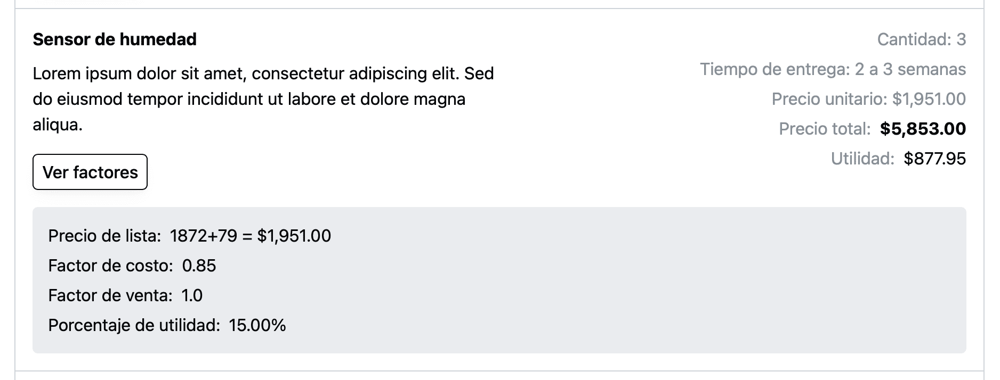
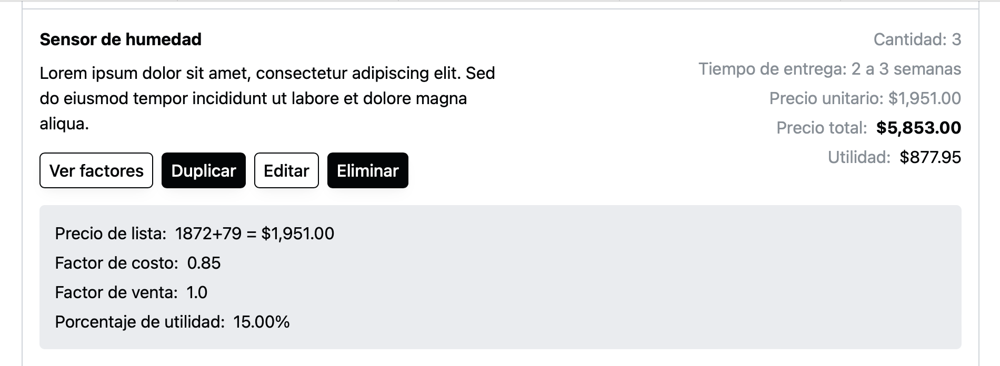
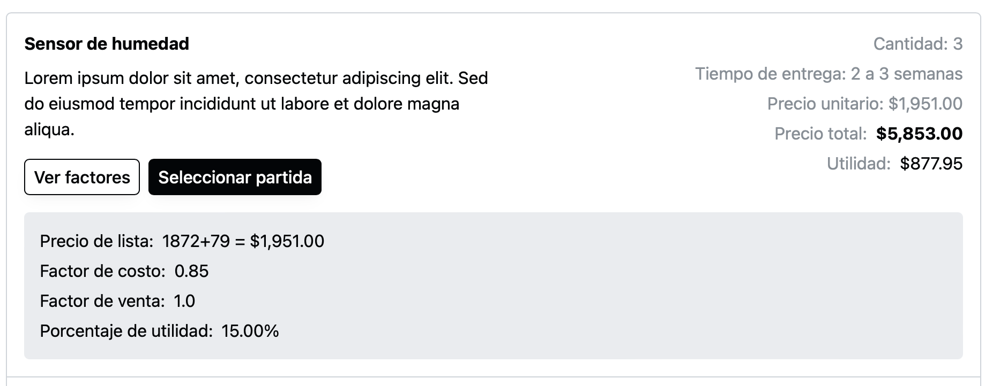

Es muy común que al ver una cotización, quieras volver a ver los factores que se usaron para construir la cotización.

Ahora ver estos factores con Industrially es muy sencillo. En las partidas de cotización, ya sea cuando que la cotización haya sido publicada…

o esté en edición…

o la estes viendo para importar una partida…

Podrás dar click en “Ver factores” para mostrar o ocultar los factores que se usaron.

## Sobre el formato del precio de lista

Algo que tal vez se pueda ver raro es que el precio de lista se presenta como: “expresión aritmética = valor en pesos”.

Esto es porque en la cotización lo que se captura en precio de lista no es solo un número, sino que puede ser una expresión aritmética (sumas, restas, multiplicaciones, etc), por lo que creemos que es útil mostrar tanto la expresión como el resultado.