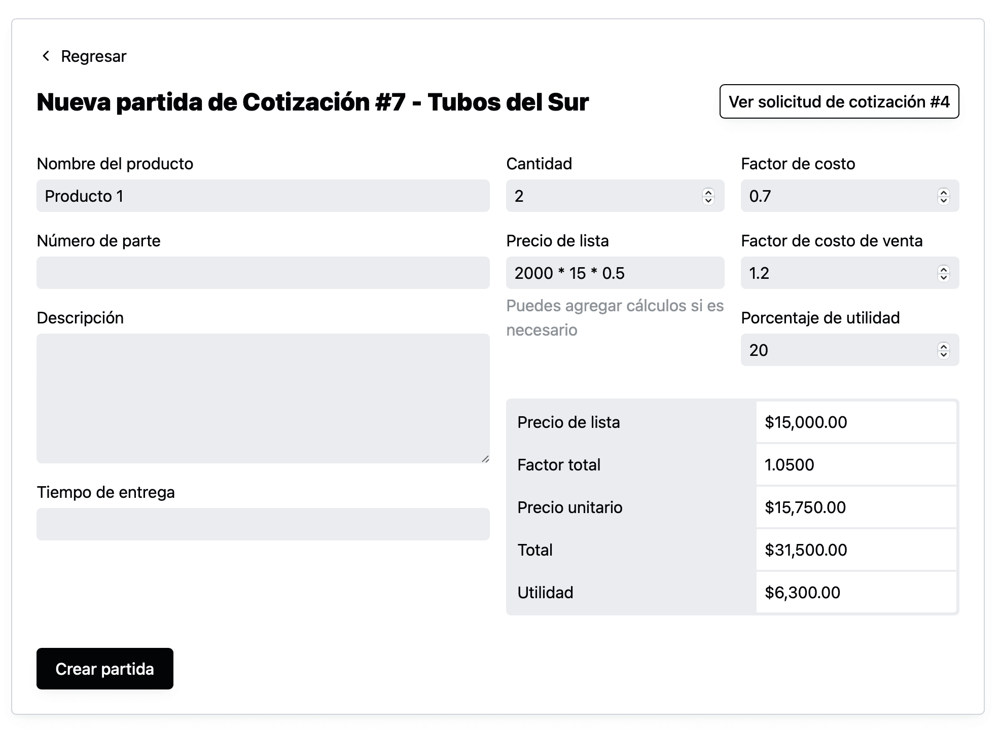
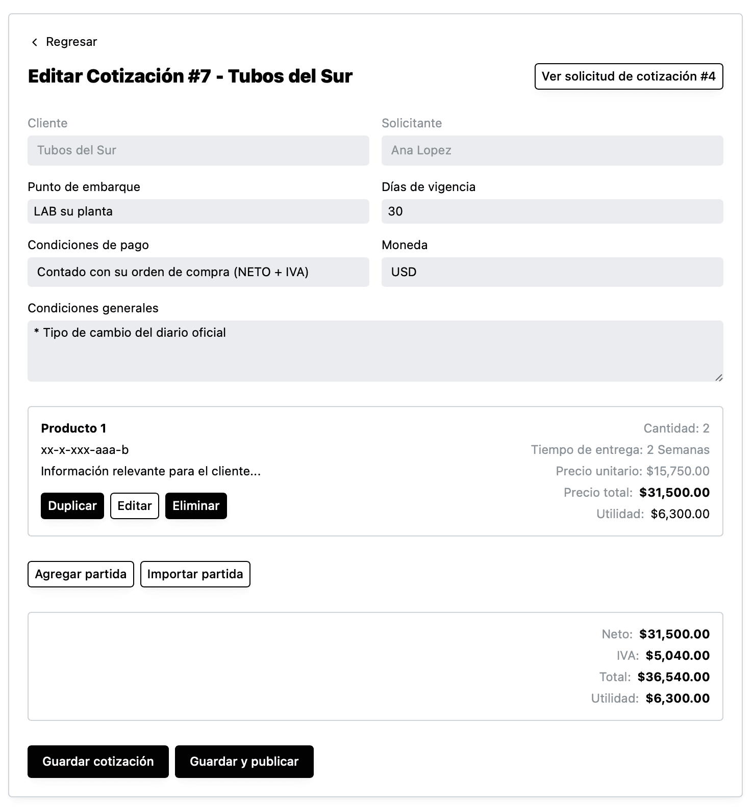

Para agregar una partida manualmente da click en “Agregar partida” y el sistema mostrará una pantalla como la siguiente:

En esta página podrás ir y regresar a la solicitud de cotización por si necesitas revisar alguna información.

En la sección del lado derecho al modificar los campos de **cantidad, precio de lista, factor de costo, factor de costo de venta** y **porcentaje de utilidad**, se actualizará automáticamente los cálculos de la parte de abajo.

Algo que podría ser muy útil, es la capacidad de agregar fórmulas aritméticas en el campo de **precio de lista** como se muestra en la imagen.

Cuando tengas la información necesaria puedes dar click en “Crear partida” y el sistema te regresará a la edición de la cotización mostrando la información de la partida.

