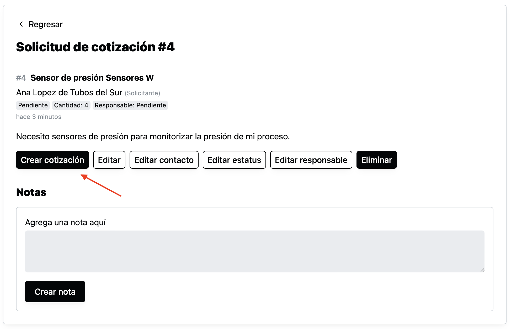
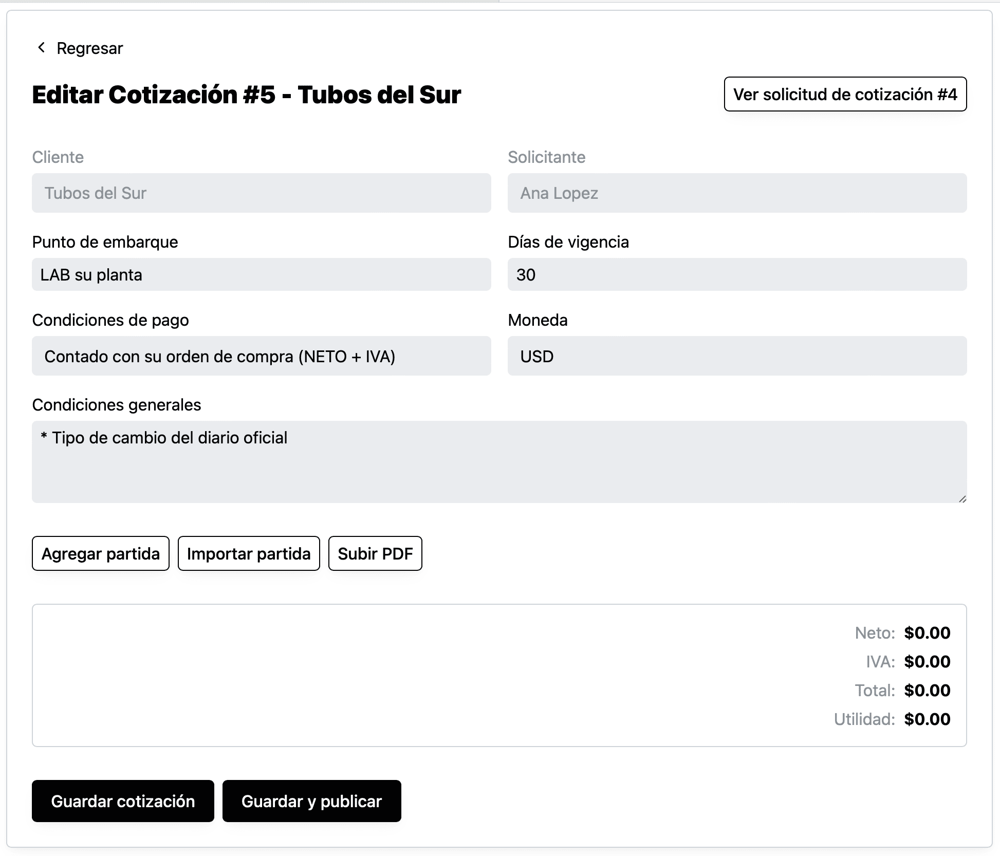
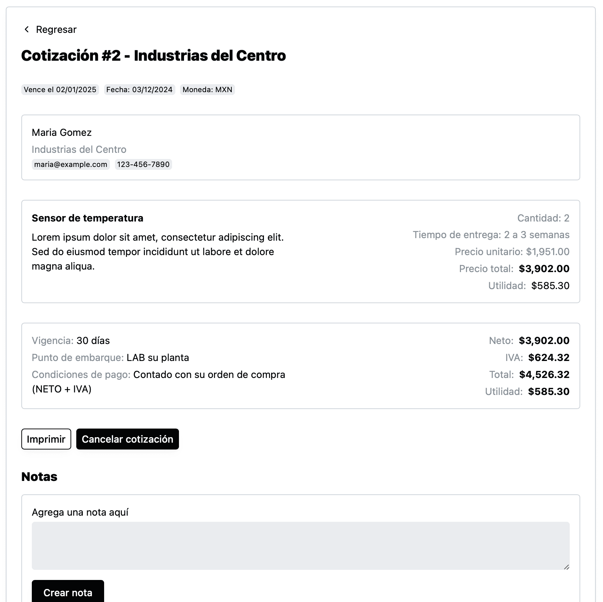

Para crear una cotización una cotización es necesario antes haber creado una solicitud de cotización.

Una vez creada la solicitud de cotización, puedes ir a la página de la solicitud y dar click en “Crear cotización”

Al dar click el sistema creará una nueva cotización en estado de “Edición” y te llevará a ella.

La cotización es creada con varios valores “default” o “por defecto”.

- **El cliente** es tomado directamente del solicitante seleccionado en la solicitud de cotización y no se puede modificar.
- **El solicitante** que es el contacto seleccionado en la solicitud de cotización.
- **Punto de embarque, días de vigencia, condiciones de pago, moneda y condiciones generales** son valores tomados de la configuración general de la cotización.

<aside class="p-4 bg-gray-100 rounded-lg">
👉 [Cómo modificar los valores predeterminados para las cotizaciones](como-modificar-los-valores-predeterminados-para-las-cotizaciones)
</aside>

Una vez en la página de cotización tienes tres opciones para agregar partidas a la cotización:

* [Agregar partida manualmente](como-agregar-partida-manualmente)
* [Importar partida de otra cotización](como-importar-partida-de-otra-cotizacion)
* [Duplicar partida dentro de la misma cotización](como-duplicar-partida-dentro-de-la-misma-cotizacion)

También tienes la opción de [Subir PDF](como-subir-pdf-de-cotizacion), para los casos en los que prefieras generar la cotización en otro sistema y solo subir el pdf en Industrially.

## Guardar cotización

Si modificaste alguno de los valores de la cotización como **punto de embarque, días de vigencia, condiciones de pago, moneda y condiciones generales**, necesitas dar click en “Guardar cotización” para que el sistema realmente los guarde.

Al guardar el sistema te regresará a la misma página de edición de la cotización con un mensaje de éxito.

## Guardar y publicar cotización

Si la cotización ya esta lista para ser compartida con tus clientes, ya sea que hayas agregado, importado o subido un PDF, ahora puedes dar click en “Guardar y publicar”, al dar click el sistema guardará la información que aún no haya sido guardada, marcará la cotización como publicada y mostrará la información de una manera distinta.

Una vez publicada la cotización ya no podrá ser editada de nuevo, pero sí podrás cancelarla.

También desde esta página, podrá imprimir la cotización y agregar notas.