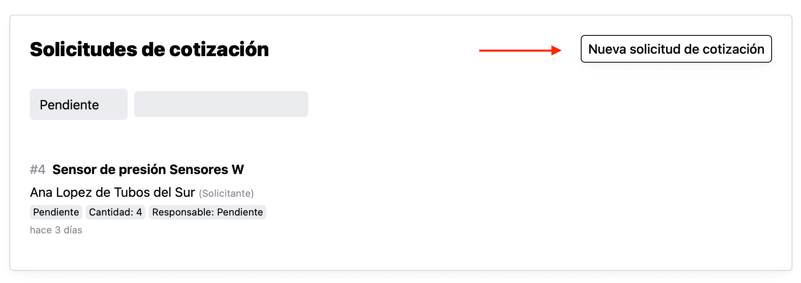
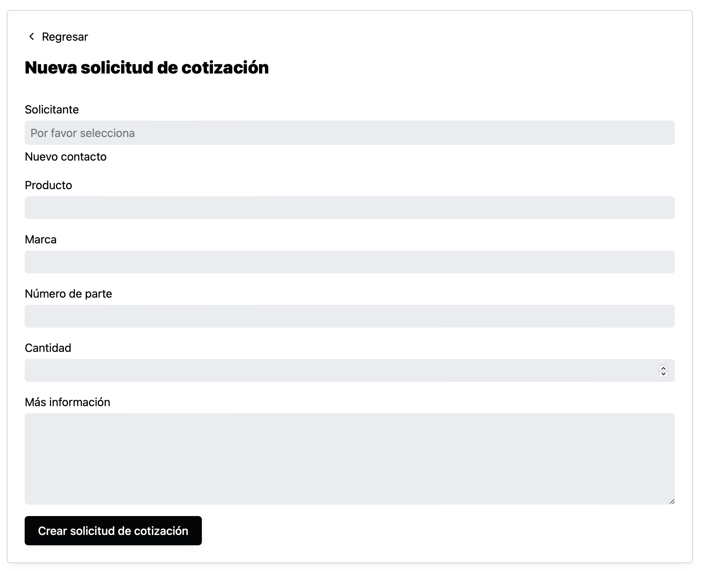
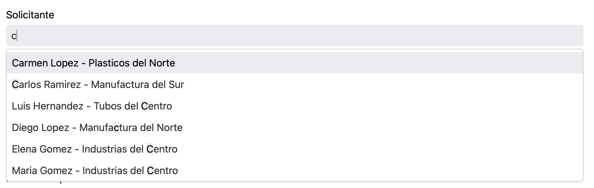
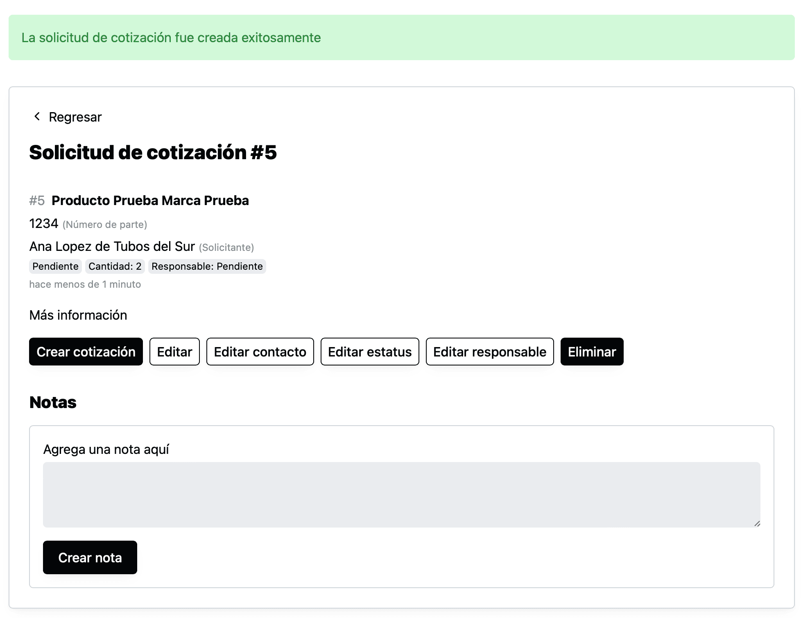
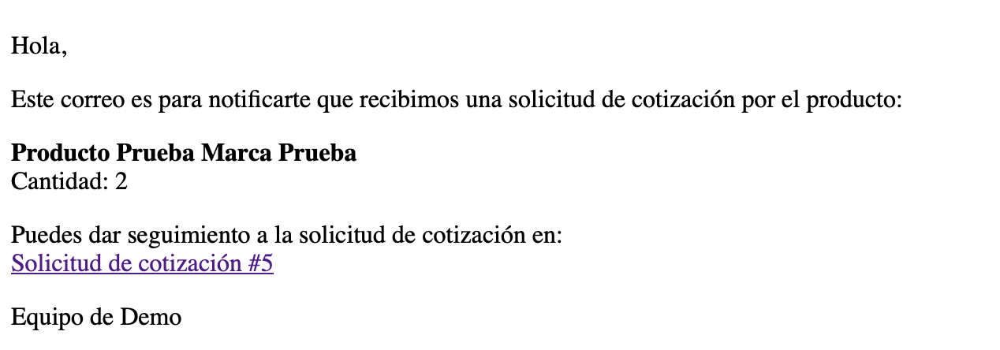

Para crear una solicitud de cotización, vas a la página de solicitudes de cotización y das click en “Nueva solicitud de cotización”

Ahí verás una forma para capturar la información de la solicitud.

Ahí el primer paso es seleccionar un "Solicitante". Al dar click en el campo se abrirá se mostrará una lista, que puedes filtrar, con los "Contactos" que tienen registrados.

Si el contacto que solicita la cotización, aún no está registrado, puedes crear un nuevo contacto, dando click en "Nuevo contacto".

<aside class="p-4 bg-gray-100 rounded-lg">
💡 En el siguiente artículo se detalla un poco más el proceso para crear un nuevo contacto al crear una solicitud de retiro:
[Nuevo contacto al crear solicitud de cotización](/nuevo-contacto-al-crear-solicitud-de-cotizacion)
</aside>

Después podrás llenar los demás campos: Producto, Marca, Número de parte, Cantidad y "Más información" y dar click en "Crear solicitud de cotización".

Y el sistema te llevará a la página de la solicitud de cotización con un mensaje de éxito al crear la solicitud.

Ahí podrás:

- Crear una cotización para esa solicitud
- Editar la información de la solicitud
- Editar la información del contacto
- Editar el estatus
- Editar el responsable
- Eliminar la solicitud de cotización
- Agregar notas

También se enviará un correo a todos los miembros del equipo y al solicitante, similar a este:

