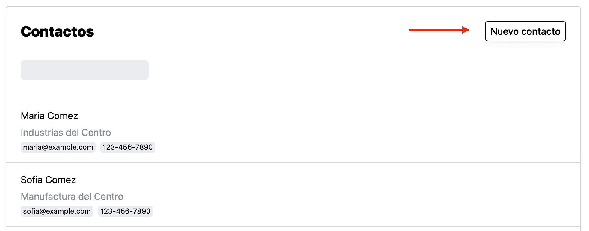
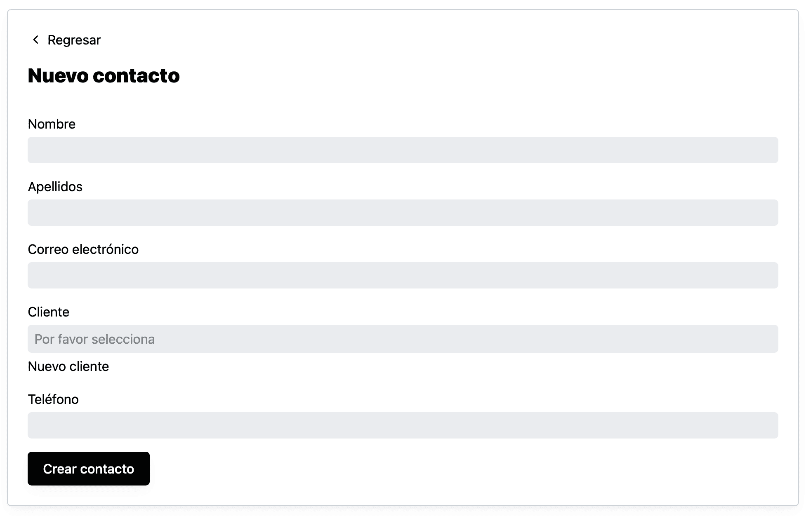
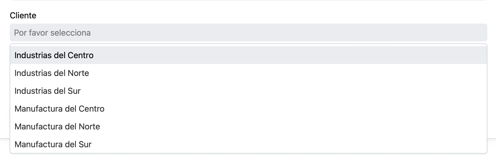
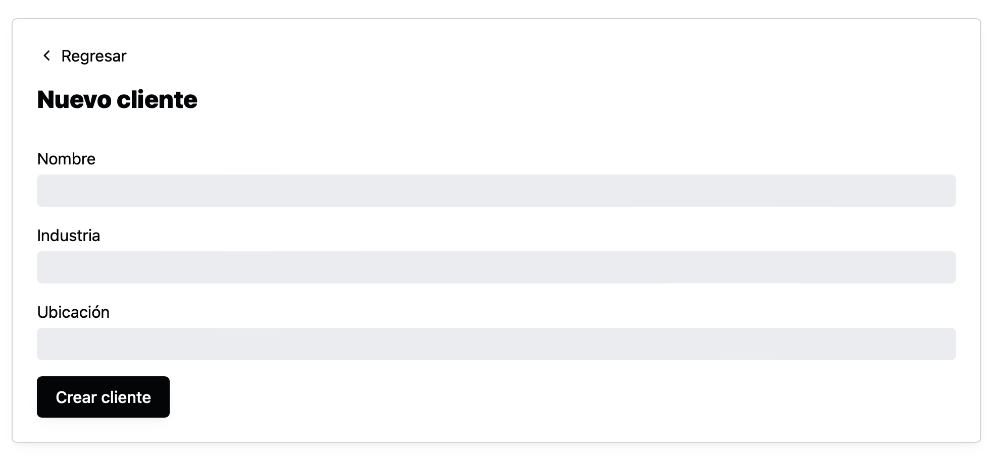

Para crear un cliente, ve a la página de contactos dando click en “Menú” y después en “Clientes”.

Da click en “Nuevo contacto”

El sistema mostrará una forma para introducir la información del contacto

Al dar click en el campo de cliente, se mostrará una lista, que también puedes filtrar, con los clientes registrados en el sistema.

Si el cliente aún no está registrado puedes dar click en "Nuevo cliente" para registrarlo.

Se mostrará una forma para registrar al nuevo cliente.

Al dar click en "Crear cliente" el sistema te regresará a la forma del "Nuevo contacto" para que puedas seleccionar al cliente que acabas de crear y al dar click en "Crear contacto" se creará el contacto.
