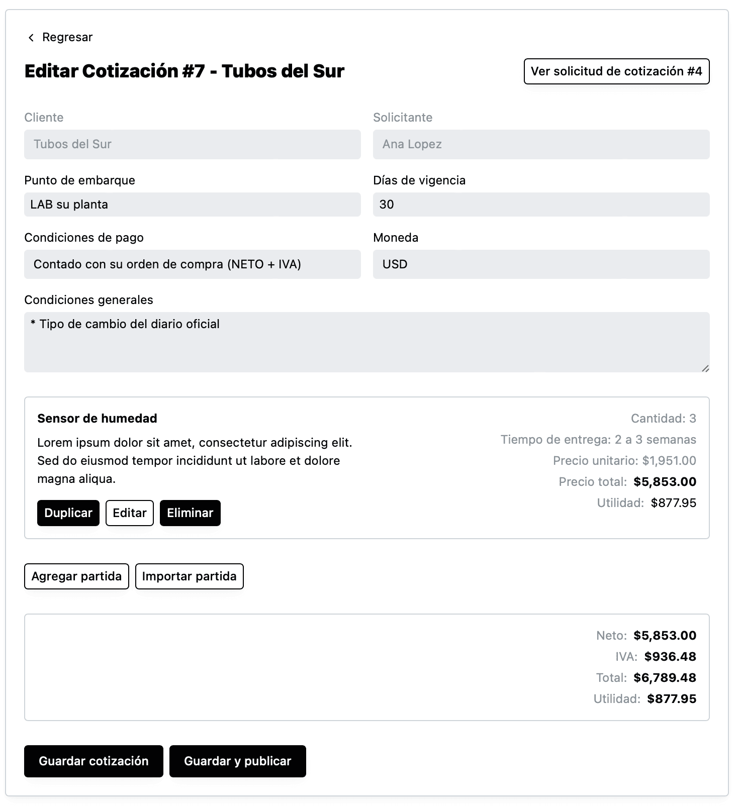

Una vez que ya [agregaste una partida a la cotización](como-crear-una-cotizacion.html), tienes la opción de dar click en “Duplicar” y el sistema va a copiar la partida.

Una vez duplicada la partida, puedes dar click en “Editar” para cambiar la información que necesites.

