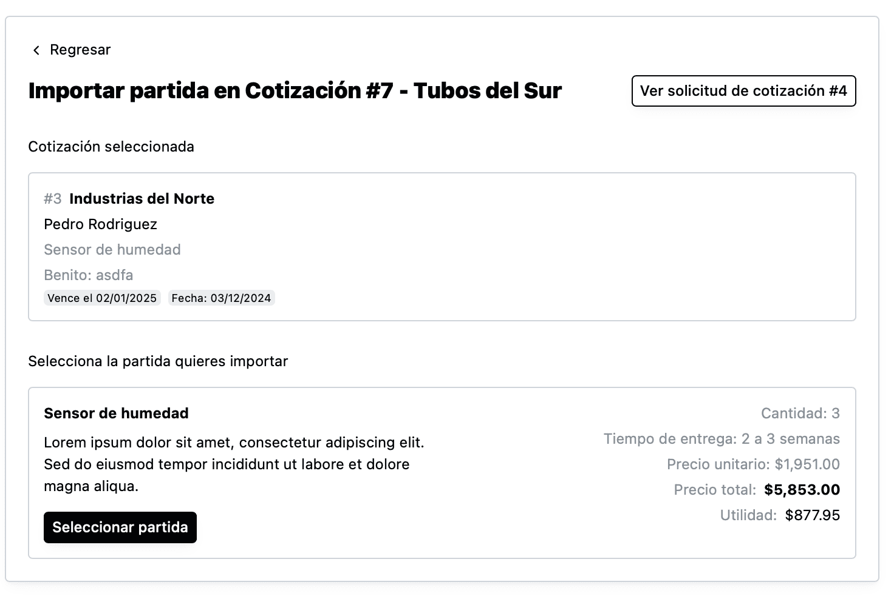

Si quieres importar una partida de otra cotización publicada anteriormente, da click en “Importar partida” [en la página de cotización](como-crear-una-cotizacion.html) y el sistema te mostrará una pantalla para poder seleccionar la cotización de la que quieres importar la partida.

Para agregar una partida manualmente da click en “Agregar partida” y el sistema mostrará una pantalla como la siguiente:

En esta página podrás ir y regresar a la solicitud de cotización por si necesitas revisar alguna información.

También podrás usar el campo de búsqueda para filtrar la cotización que necesitas. Podrás buscar por todos los atributos de la cotización, incluyendo las partidas, cliente, solicitante y notas.

Una vez que encuentres la cotización, puedes dar click en ella y el sistema te mostrará las partidas de la cotización para poder seleccionarlas:

Al dar click en “Seleccionar partida”, el sistema copiará la partida en la cotización que estés editando.

Ahí, si necesitaras cambiar algo, puedes dar click en “Editar” y para cambiar la información que necesites.