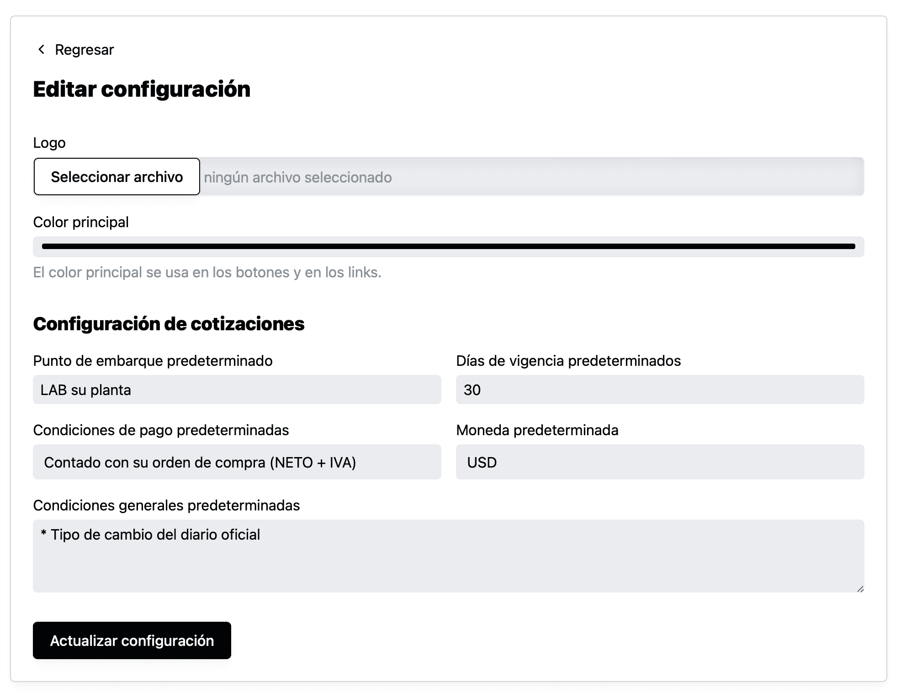

En cada cotización creada los valores de **punto de embarque, días de vigencia, condiciones de pago, moneda y condiciones generales** son valores tomados de la configuración general de la cotización.

Estos valores se pueden modificar en la página de configuración que puedes acceder dando click al “Menú” y después en “Configuración”. Ahí verás una página como la siguiente:

Los valores que guardes aquí se usarán como default en todas las cotizaciones que creen en la cuenta.