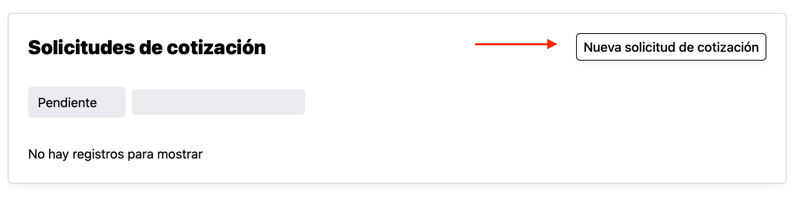
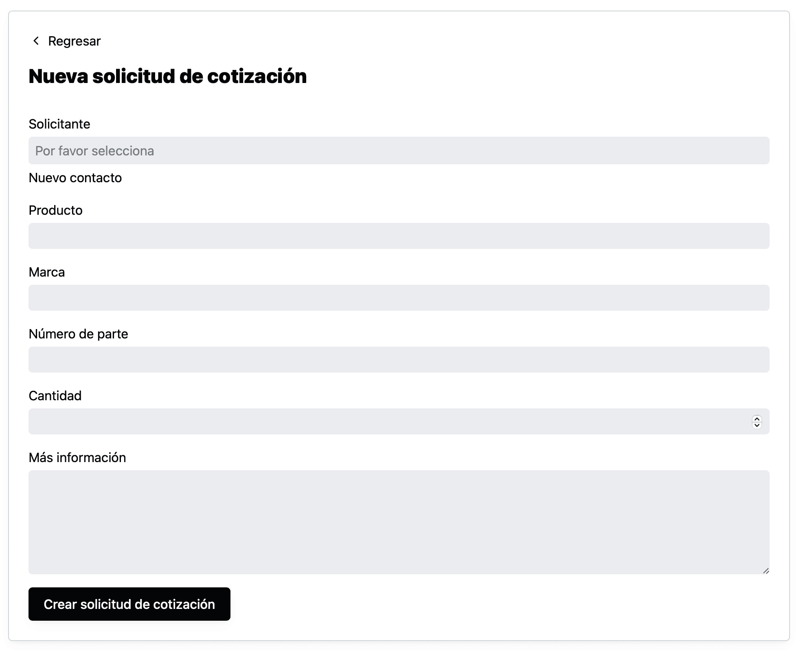
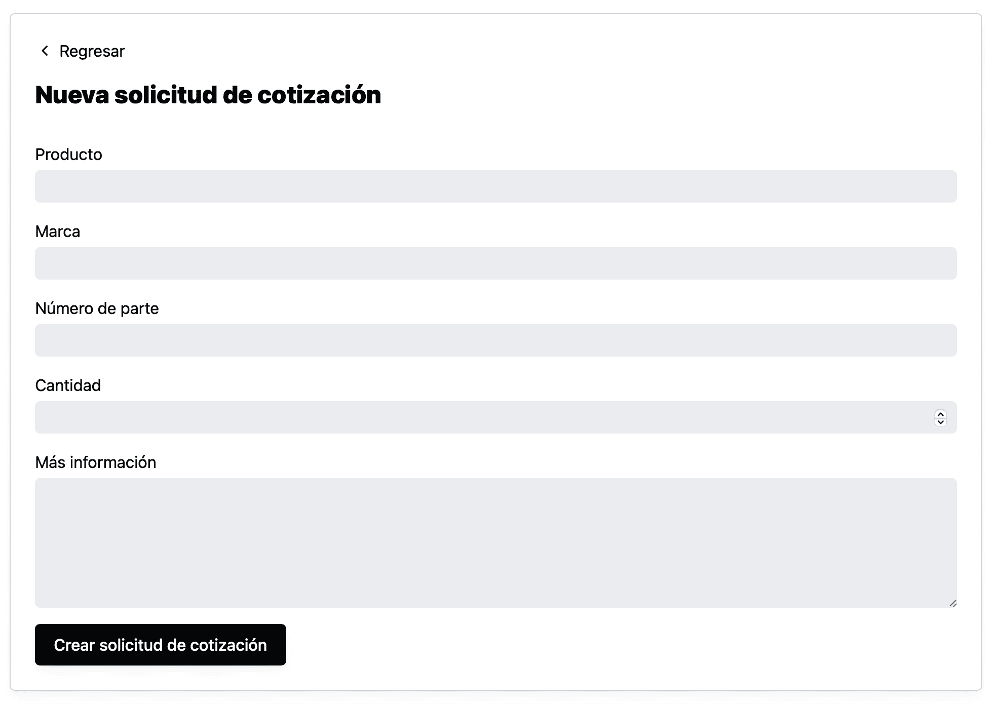

Industrially permite que tus usuarios puedan solicitar cotización directamente en la plataforma. Lo único que se necesita en tu sitio web es que agregues un link para que tus clientes puedan ir a la página correcta.

Aquí vas a aprender qué link es el que debes de usar, cómo puedes escribir un link en tu sitio, y qué vive tu cliente cuando da click a ese link.

## Link para enviar a la forma de solicitud de cotización

Para enviar a tus clientes a la forma de solicitud de cotización de tu empresa, puedes ir a la página para hacer una nueva solicitud de cotización.

Y toma el url que haya en esa página.

Ese link es el que puedes compartir y usar en tu página para llevar a tus clientes a la forma de solicitud de cotización.

## Estructura del link de la forma de solicitud de cotización

Si analizamos el link de la imagen, el esta formado por las siguientes partes:

**https://** - Esto lo tienen todos los links (bueno casi todos), es parte del protocolo de comunicación.

**demo** - Este es el subdominio, este es específico para tu empresa, en este caso la cuenta que estoy usando se llama “demo”.

**[industrially.net](http://industrially.net)** - Es el dominio de la aplicación

**quote_requests/new** - es el “path” o ruta de la aplicación que envía a la forma de solicitud de cotización.

Lo único que va a cambiar para tú link va a ser el subdominio de tu empresa. Si fuera “miempresa”, entonces el link sería: `https://miempresa.industrially.net/quote_requests/new`

Pero si esta explicación es muy técnica, no te preocupes es normal, puedes seguir las instrucciones del punto anterior, es lo mismo.

## Cómo puedes configurar un link en tu sitio

Esto depende un poco de que tanto tienes acceso al código de tu sitio y de cómo quieres que se vea el link o botón.

Si tuvieras acceso al html del sitio, lo más simple es poner un “link”  que utiliza el tag `a`  por ejemplo:

`<a href="demo.industrially.net/quote_requests/new">Solicitar cotización</a>`

Este tag tiene la siguiente estructura `` dentro de las comillas del `href` se pone el url que obtuviste y adentro de los tags puedes poner cualquier texto, en este caso yo escribí “Solicitar cotización”.

Puedes tener muchos de estos links donde lo creas necesario.

## Qué ven tus clientes cuando dan click a tu link que los lleva a la forma de solicitud de cotización

Esto depende de si tu cliente ya inició sesión en tu cuenta:

Si tu cliente no ha iniciado sesión el sistema primero lo llevará a iniciar sesión:

Si ya tiene una cuenta podría iniciar sesión ahí, si aún no la tiene, puede dar click en “Registrarme” y el sistema lo llevará a la página de registro.

Este registro es una página específica para tu empresa. Una vez que se registró, ese cliente ya tendrá un “usuario” en tu sistema y habrá creado un nuevo “contacto”, que tú como miembro del equipo podrás ver en la página de contactos.

Después tu cliente llegará a la forma de solicitud de cotización donde ya no tendrá que volver a capturar sus datos. De aquí en adelante que llegue a tu portal de industrially desde tu sitio o desde cualquier lugar ya no tendrá que volver a capturar sus datos.

