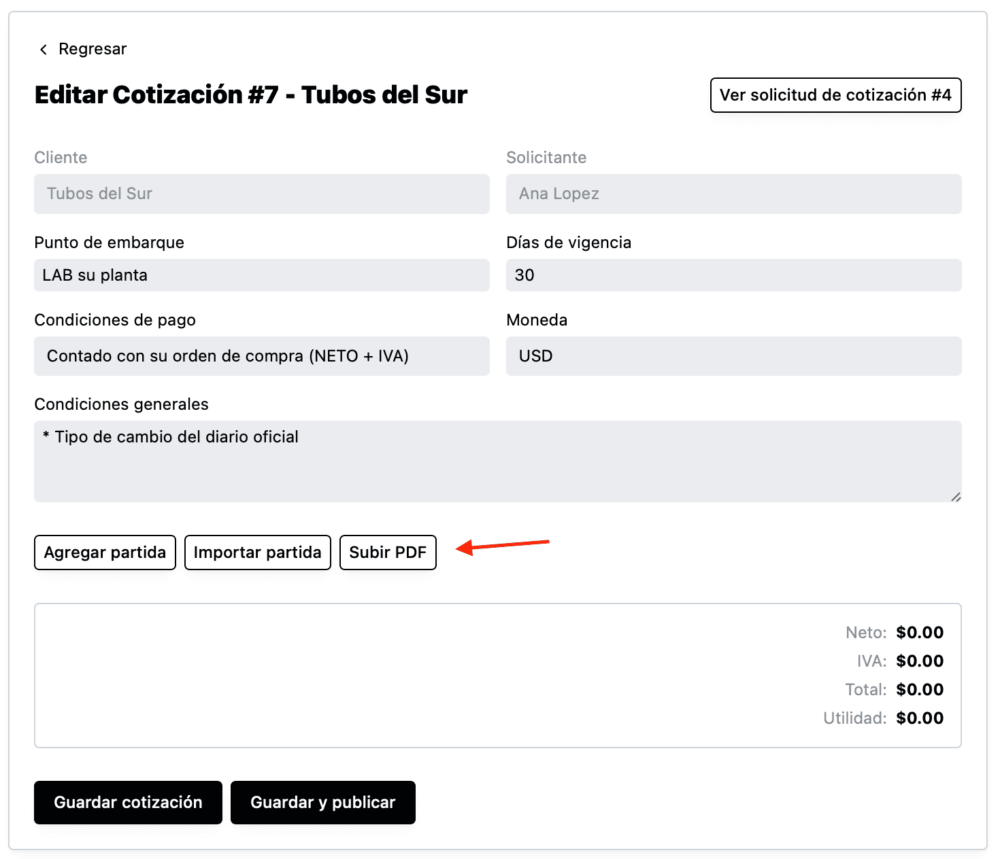

Si prefieres generar la cotización en otro sistema y solo subir el PDF en Industrially, puedes dar click en “Subir PDF”

Al dar click el sistema mostrará una forma para subir el archivo, capturar el total neto (sin IVA) y opcionalmente poner el “ID externo” (el ID de la cotización en el sistema externo).

Al guardar la cotización el sistema mostrará de nuevo la edición de la cotización, mostrando una miniatura del PDF y la posibilidad de verlo y de editar los datos si así lo necesitas.

