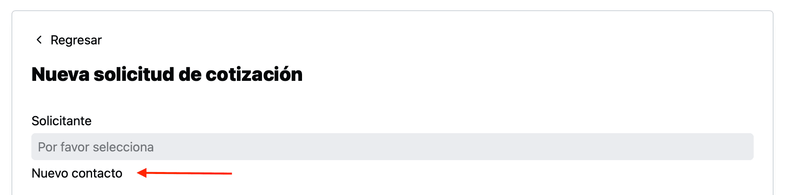
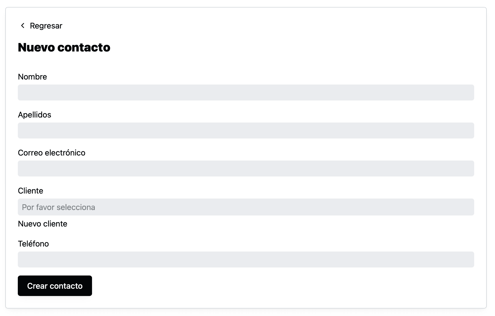

Si necesitas [crear una solicitud de cotización](como-crear-una-solicitud-de-cotizacion.html) para un contacto que aún no está registrado en el sistema, desde la forma de “Nueva solicitud de cotización”, puedes dar click en “Nuevo contacto”

Aquí se mostrará una forma para dar de alta al nuevo contacto.

Al dar click en el campo de cliente, se mostrará una lista, que también puedes filtrar, con los clientes registrados en el sistema.

Y de forma similar, si no está registrado puedes dar click en “Nuevo cliente” para registrarlo.

Se mostrará una forma para registrar al nuevo cliente.

Al dar click en “Crear cliente” el sistema te regresará a la forma del “Nuevo contacto” para que puedas seleccionar al cliente que acabas de crear y al dar click en “Crear contacto”, te regresará a la forma de la solicitud de cotización para que puedas continuar.